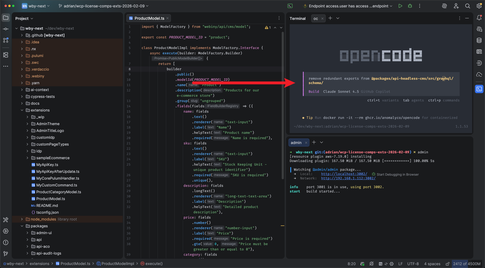
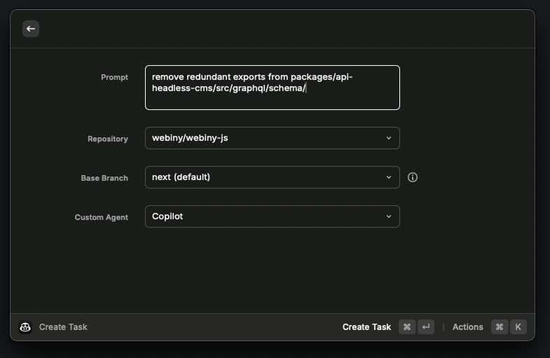
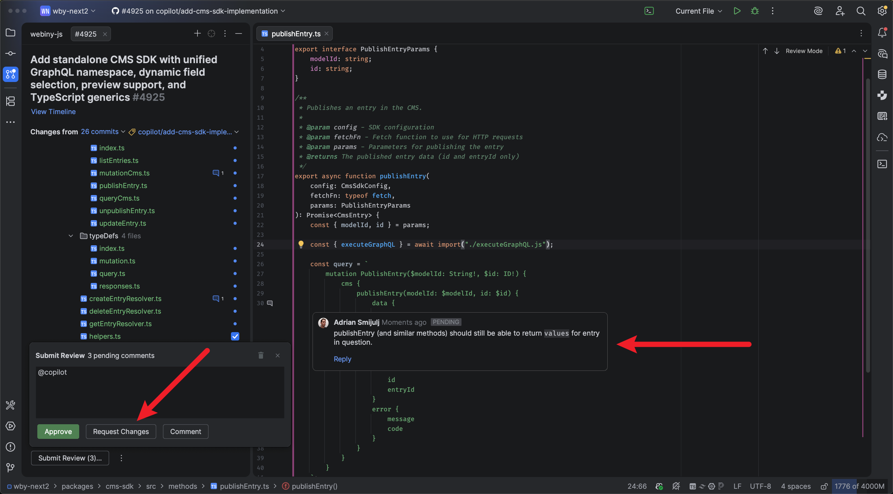

# How I Work with AI in 2026

A couple of years ago, I was still copying code from ChatGPT's web interface, pasting it into my editor, fixing the inevitable formatting issues, and repeating the process until things worked. If you've been there, you know how tedious that gets.

Then GitHub Copilot came along with its inline autocomplete, and that felt revolutionary. Suddenly the AI was right there in my editor, suggesting completions as I typed. No more context switching to a browser, no more copy-paste gymnastics. Just write a comment or start a function, and relevant code would appear. That alone was mind-blowing at the time.

Fast forward to today, and I've moved well beyond even that. Not by using less AI—quite the opposite. I'm using AI more than ever, and I write very little code manually anymore, if any. That's mind-blowing in itself. But it's all happening through three tools that actually fit into how I work as a developer.

Let me walk you through my current setup.

## 1. OpenCode for Local Development

When I'm working locally, OpenCode is my go-to. It's a CLI tool that lives right in my terminal, and honestly, it's changed how I think about AI-assisted coding.

What I like about it is that it's just easy to use. Tab to switch modes. Easily switch models or continue previous sessions. Fuzzy file search when referencing files. And switching between different providers—Anthropic, OpenAI, Google, whatever—without needing to install their CLI tools or individual harness apps. It's all just there.

What I especially like is running OpenCode directly in WebStorm's integrated terminal. I barely touch standalone terminal apps like Warp anymore—everything happens inside my IDE. When I open a terminal tab and run `opencode`, it's automatically scoped to my current project. No need to `cd` around or manage contexts.

The integrated terminal makes this work beautifully. I can rearrange panes however I want—OpenCode at the top, with tabs below for dev servers, logs, or build watchers. Everything organized exactly how I need it. And if I have multiple WebStorm windows open for different projects, each one has its own OpenCode instance already scoped correctly. No context switching, no accidentally running commands in the wrong directory.

When OpenCode makes changes, I prefer using WebStorm's Commit tab over the CLI diffs. The IDE's diff viewer is just easier—proper syntax highlighting, side-by-side comparison, the works.

It's a simple setup, but it works: OpenCode lives in my terminal, stays scoped to my project, and keeps me in control while handling the tedious parts.

## What About WebStorm's Copilot Plugin?

You might be wondering: why OpenCode in the terminal when WebStorm has its own Copilot plugin?

I tried it. I really did. The idea of having AI assistance directly integrated into the IDE sounds perfect on paper. But in practice, I found the UI to be clunky and a bit buggy. The text editor where you write prompts just doesn't behave as smoothly as I'd like—there's friction in the interaction that breaks my flow.

The most annoying thing? When the plugin executes a terminal command, it suddenly opens a new tab in the terminal section to run it. Then you have to close that tab and navigate back to the Copilot plugin. It's distracting, it breaks your focus, and it just doesn't feel good.

OpenCode isn't perfect either, but here's the difference: I can manage everything via keyboard. No clicking around, no fighting with UI elements that don't quite respond right, no surprise tab-switching. Just type, read, respond. That keyboard-first workflow is everything when you're trying to stay in the zone.

So for now, OpenCode in the terminal wins out. It's simpler, more predictable, and it stays out of my way.

## 2. GitHub Copilot Extension for Raycast

Here's where things get interesting.

Sometimes I need to spin up multiple AI tasks at once—maybe I'm exploring different approaches to a problem, or I need to refactor several components simultaneously. For this, I use the GitHub Copilot extension for Raycast.

If you're not familiar with Raycast, it's essentially a launcher on macOS. But with the Copilot extension, it becomes a quick way to spawn parallel AI tasks that run on GitHub's infrastructure.

One quirk: if you need to write a longer, more detailed prompt, the Raycast text field isn't ideal. I usually draft it in markdown in WebStorm first, then paste it into Raycast once I'm happy with it. The cool part? Copilot's autocomplete helps me write the prompt itself. AI helping me write prompts for AI. Not a dealbreaker, just a small friction point—with a nice upside.

Beyond spawning tasks, the extension has a few other nifty features that come in handy: listing all active agent tasks, checking Copilot usage, and a couple other utilities. Nothing groundbreaking, but useful when you need them.

The use case is pretty specific: when I'm in the early stages of a feature or trying to parallelize work across different parts of the codebase, I can fire off multiple agents from Raycast, each working independently on their piece of the puzzle. They run on GitHub's side, so I'm not blocking my local environment.

I use this more often than you might think—for small refactors, medium-sized features, even large implementations. The bigger the task, the more important it is to spec it out clearly, but that's a whole other story. The point is: parallel execution through Raycast has become a regular part of my workflow, not just an occasional power move.

## 3. PR Reviews in My IDE

Now, here's the piece that ties everything together: code review.

When AI generates code—whether through OpenCode locally or through tasks spawned from Raycast—it needs review. And honestly, the PR interface is the perfect place for this.

I review PRs directly in WebStorm using its GitHub integration. The code is right there in my editor, I can leave inline comments on specific lines, request changes, and the AI (via `@copilot` mentions) can respond to my feedback directly in the PR.

The workflow looks like this: AI opens a PR with the generated code, I review it right in my IDE (or sometimes on GitHub's mobile app when I'm on the go), leave comments on anything that needs adjustment, and the AI iterates based on my feedback. Once I'm happy, I approve and merge.

What's great about this approach is that it mirrors how I'd review code from any other developer. The PR becomes a record of what changed, why it changed, and what feedback was incorporated. When I come back to this code six months from now, that context is invaluable.

Sometimes I'll also use GitHub's web UI for reviews, especially if I need to check CI results or cross-reference with other PRs. And honestly, the mobile app has been surprisingly useful for quick reviews when I'm away from my desk—I can approve a simple change or leave a comment without needing to open my laptop.

## Final Thoughts

The key insight here isn't about the specific tools—it's about finding AI workflows that actually integrate with how you already work.

I'm not changing my entire development process to accommodate AI. I'm using AI to enhance the process I already have: local development, parallel execution when needed, and PR-based review for everything that matters.
