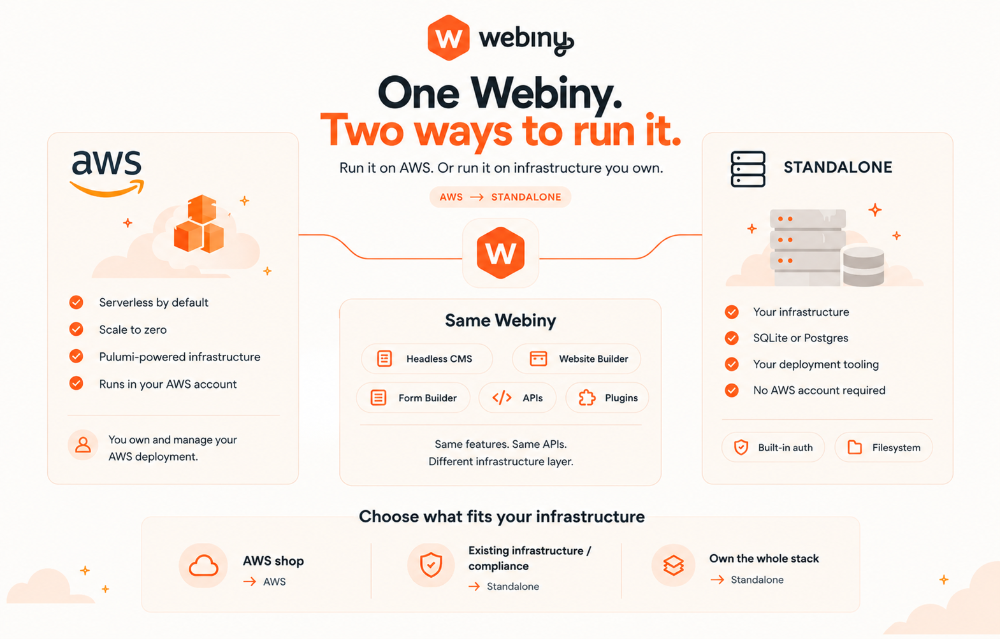

Webiny has been AWS-only since the very first day of v5. Lambda, DynamoDB, S3, Cognito, CloudFront, Step Functions. If you wanted to run Webiny, you needed an AWS account, and that was that.

For a long time this was a deliberate choice, and we still think it was the right one. Picking one cloud and going deep meant we could use the good parts properly instead of settling for whatever the lowest common denominator across three providers happened to be. Serverless by default, no servers to patch, scale to zero when nobody's using it.

But over the past year or so, the same conversation kept coming up. Someone would find Webiny, like it, and then ask the one question we had no good answer for: "can we run this on our own infrastructure?"

And every time, the answer was no.

## The users we couldn't say yes to

The people asking weren't a single group. Over time a few clear patterns showed up.

There are teams in regulated industries where data simply cannot leave a specific set of machines. Healthcare, finance, government. It's not that they dislike AWS, it's that a compliance document says the data lives in a particular building.

There are companies that already made their infrastructure bet years ago. They have a Kubernetes cluster, a Postgres instance, a team that knows how to operate both. Asking them to add an AWS account and learn Lambda for one CMS is a hard sell, and honestly it should be.

There are the people who are just not an AWS shop. GCP, Azure, Hetzner, a rack in an office. Nothing wrong with any of it.

Every one of these was a conversation that ended with us saying "sorry, not yet." That gets old.

## So here it is

Webiny now has a standalone version. A server you own, a cluster you already operate, whichever cloud you happen to be on, or a machine under someone's desk. No AWS account anywhere in the picture. For a product that has been serverless since day one, this is the biggest change to how Webiny gets run that we've ever made.

It's an alpha release. The core is in place and it runs, and we'd rather get it onto real infrastructure now than keep polishing it in private.



## What you actually run

Standalone Webiny is a Node process. You give it a SQL database and a place to put files, and that's roughly the shape of it.

**SQL instead of DynamoDB.** Two options today, and you choose when you create the project. SQLite is a single file with nothing to operate, which also means getting Webiny running on your laptop no longer involves deploying anything to anywhere. Postgres is there when you'd rather run a real database server. OpenSearch is in progress, for the same reason the AWS version offers it, which is content sets big enough that you want a search engine behind them.

**Built-in auth instead of Cognito.** Users live in your database, with passwords hashed using scrypt and a per-user salt. Password reset goes over email once you've configured a mail provider, and because plenty of fresh installs haven't, there's a fallback for whoever owns the machine so you can't lock yourself out on day one. It's gated behind a signing secret and you can switch it off in the config.

Built-in auth is the default, not the only option. Okta, Auth0 and the other SSO providers Webiny already supports plug into the standalone version the same way they do on AWS, so a company that authenticates everything through one identity provider doesn't have to make an exception for the CMS.

**The filesystem instead of S3.** File Manager writes where you tell it to.

**Everything else in the same process.** Background tasks, scheduled jobs and websockets used to be Step Functions, EventBridge and API Gateway. Standalone runs all three itself, with the same task definitions and the same behaviour.

**Your deployment tooling instead of ours.** The AWS version deploys through Pulumi. It's good, it has served us well for years, and it's still our choice landing in your repository. Plenty of organisations settled their infrastructure practice long before they found Webiny, and telling a team that runs everything through Terraform or CDK to keep one more tool around for the CMS is a real cost. A standalone Webiny is a Node process and a database, so you deploy it however you already deploy things. We don't need an opinion about it.

Nothing above that layer changed. Headless CMS, Page Builder, Form Builder, ACO, audit logs, the admin app. Same features, same APIs.

That last bit is worth saying slowly, because it's the part people assume can't be true. The APIs don't change. Not the GraphQL schema, not the plugin APIs, not the extension points. Whatever you built on top of Webiny on AWS, custom fields, plugins, admin UI extensions, lifecycle hooks, runs on the standalone version as it is. You're not porting anything.

## Trying it

Node 24 or newer, and then:

```bash
npx create-webiny-project@alpha my-webiny-project
```

The setup wizard opens with a question it never used to ask: how would you like to host this project? Pick Standalone, then pick a database, SQLite or Postgres. Everything after that is the project scaffolding you already know.

```bash
cd my-webiny-project
yarn dev
```

<video src="./standalone-webiny/installation-standalone.mp4" controls muted loop playsinline></video>

*The clip pins an exact version, `6.6.0-alpha.4`, which is what `@alpha` resolved to at the time.*

That clip is the whole thing, and what matters is how little is in it. Under a minute from an empty folder to Webiny running at `http://localhost:3001` with the setup wizard waiting for your first admin user, most of that spent installing packages. No AWS account. No deployment. Nothing provisioned, nothing to configure, no credentials anywhere.

That's the part worth sitting with. On AWS you can run the admin app on your machine, but the backend has to be deployed before it has anything to talk to, so trying Webiny at all starts with an AWS account. Standalone runs the API on your laptop too. The longer walkthrough is in the [standalone quickstart](https://www.webiny.com/docs/get-started/quickstart/standalone).

## This isn't a fork

The part we care most about getting across: these aren't two products, and standalone isn't a stripped-down edition for people who couldn't afford the real one.

There's one Webiny. What differs is the layer at the bottom that talks to infrastructure, and that layer is thin. There is no feature gap between the two, in either direction. Nothing was cut to make standalone work, and nothing is waiting on a catch-up release. When we ship something new to the Headless CMS, it lands on both.

The AWS version is not deprecated, not legacy, and not going anywhere. There's no house preference between the two either. What we recommend depends on what you're building and where you're allowed to run it.

## So which one should you use?

Our honest take:

**If you're on AWS and happy there, stay.** Serverless, scale to zero, managed everything. If that fits how you work, it's still an excellent way to run Webiny, and it's the mature one.

**If you couldn't use Webiny before, you can now.** Compliance rules, an existing cluster, a different cloud, or a preference for a machine you can point at. That door is open, alpha and all.

**If you want to own the whole stack**, you can. Your database, your servers, your rules about who gets to touch them, and your deployment pipeline rather than ours.

## What's next

Getting out of alpha is the job. OpenSearch support, deployment guides, Docker and Kubernetes setups, and the rough edges you find in week one. The first few months of real installs will teach us things we can't learn any other way, which is most of the reason this post exists.

## Wrapping up

This took a lot longer than we hoped, and we're glad we didn't rush it. Webiny being serverless-only was a real limitation for a lot of teams, and now it isn't.

If you've been waiting on this to give Webiny a try, we'd genuinely like to hear how it goes, including the parts that annoy you. Early feedback on this is worth more to us than almost anything else right now.
